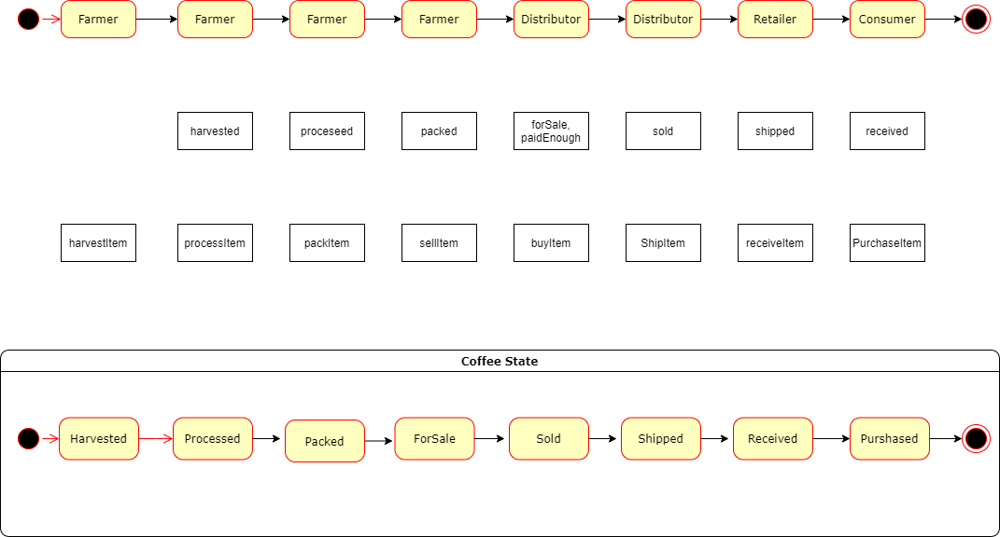
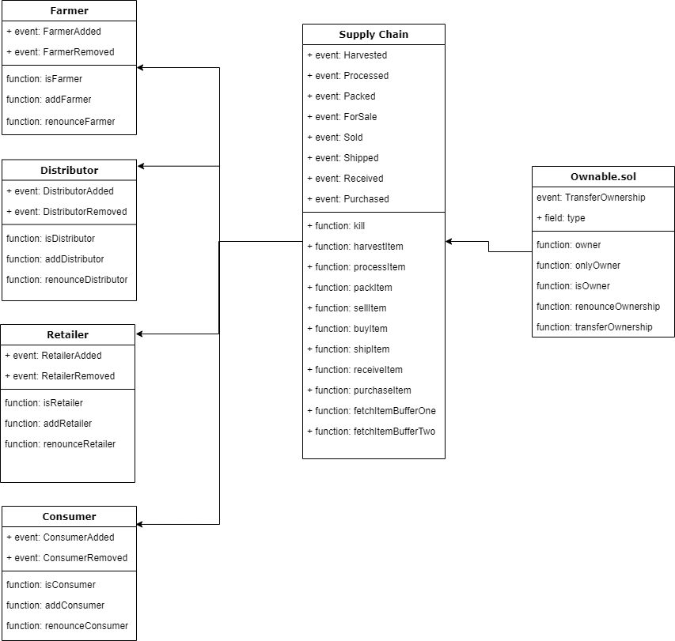

# Supply chain & data auditing

This repository containts an Ethereum DApp that demonstrates a Supply Chain flow between a Seller and Buyer. The user story is similar to any commonly used supply chain process. A Seller can add items to the inventory system stored in the blockchain. A Buyer can purchase such items from the inventory system. Additionally a Seller can mark an item as Shipped, and similarly a Buyer can mark an item as Received.

## Project write-up - Libraries
The `Roles` library was used by different access control contracts for easy add and remove in the supply chain 
`truffle-hd-wallet-provider` to sign transactions for addresses.
`truffe` is a set of tools oriented to smart contracts. You can compile, test, run and publish you contracts.
`Web3` collection of libraries to interact with ethereum, getBlocks, getAccounts, etc...

## Program Versions numbers
Truffle v5.0.2 (core: 5.0.2)
Solidity - 0.4.24 (solc-js)
Node v10.24.1
web3@1.5.2

I also run:
npm install openzeppelin-solidity@2.4 
npm install --save @truffle/hdwallet-provider

## Project write-up - UML

### Activity


### Sequence


### State


### Classes (Data Model)



## Transaction ID and contract address
Contract
https://rinkeby.etherscan.io/address/0x4392b17426b420b5b45dac9548a3d1fcd72a68b3
Address
https://rinkeby.etherscan.io/address/0x4f7A188234AF63aBd9f0FC5D7f1dB8A10F73Eaf9


Migrations dry-run (simulation)
===============================
> Network name:    'rinkeby-fork'
> Network id:      4
> Block gas limit: 30000000


1_initial_migration.js
======================

   Deploying 'Migrations'
   ----------------------
   > account:             0x4f7A188234AF63aBd9f0FC5D7f1dB8A10F73Eaf9
   > balance:             13.442254006946539249
   > gas used:            262462
   > gas price:           10 gwei
   > value sent:          0 ETH
   > total cost:          0.00262462 ETH

   -------------------------------------
   > Total cost:          0.00262462 ETH


2_deploy_contracts.js
=====================

   Deploying 'FarmerRole'
   ----------------------
   > account:             0x4f7A188234AF63aBd9f0FC5D7f1dB8A10F73Eaf9
   > balance:             13.437951736946539249
   > gas used:            403219
   > gas price:           10 gwei
   > value sent:          0 ETH
   > total cost:          0.00403219 ETH


   Deploying 'DistributorRole'
   ---------------------------
   > account:             0x4f7A188234AF63aBd9f0FC5D7f1dB8A10F73Eaf9
   > balance:             13.433918266946539249
   > gas used:            403347
   > gas price:           10 gwei
   > value sent:          0 ETH
   > total cost:          0.00403347 ETH


   Deploying 'RetailerRole'
   ------------------------
   > account:             0x4f7A188234AF63aBd9f0FC5D7f1dB8A10F73Eaf9
   > balance:             13.429884796946539249
   > gas used:            403347
   > gas price:           10 gwei
   > value sent:          0 ETH
   > total cost:          0.00403347 ETH


   Deploying 'ConsumerRole'
   ------------------------
   > account:             0x4f7A188234AF63aBd9f0FC5D7f1dB8A10F73Eaf9
   > balance:             13.425851966946539249
   > gas used:            403283
   > gas price:           10 gwei
   > value sent:          0 ETH
   > total cost:          0.00403283 ETH


   Deploying 'SupplyChain'
   -----------------------
   > account:             0x4f7A188234AF63aBd9f0FC5D7f1dB8A10F73Eaf9
   > balance:             13.403277596946539249
   > gas used:            2257437
   > gas price:           10 gwei
   > value sent:          0 ETH
   > total cost:          0.02257437 ETH

   -------------------------------------
   > Total cost:          0.03870633 ETH


Summary
=======
> Total deployments:   6
> Final cost:          0.04133095 ETH

⚠️  Important ⚠️
If you're using an HDWalletProvider, it must be Web3 1.0 enabled or your migration will hang.


Starting migrations...
======================
> Network name:    'rinkeby'
> Network id:      4
> Block gas limit: 29970705


1_initial_migration.js
======================

   Deploying 'Migrations'
   ----------------------
   > transaction hash:    0x5e8e5398d37718be314b6dc46a763b7c375c77485f5080df4c793d94d4b176ff
   > Blocks: 0            Seconds: 12
   > contract address:    0x4392b17426B420b5b45Dac9548a3d1FcD72A68B3
   > account:             0x4f7A188234AF63aBd9f0FC5D7f1dB8A10F73Eaf9
   > balance:             13.442479686946539249
   > gas used:            239894
   > gas price:           10 gwei
   > value sent:          0 ETH
   > total cost:          0.00239894 ETH


   > Saving migration to chain.
   > Saving artifacts
   -------------------------------------
   > Total cost:          0.00239894 ETH


2_deploy_contracts.js
=====================

   Deploying 'FarmerRole'
   ----------------------
   > transaction hash:    0xb8ddc10e8641607d6ec172cb6481c02485d0b09e23a30999da86cc34e91cd067
   > Blocks: 1            Seconds: 12
   > contract address:    0xb97c9B9D6c6B8255DCe2B0a4b74b89D9383dFA11
   > account:             0x4f7A188234AF63aBd9f0FC5D7f1dB8A10F73Eaf9
   > balance:             13.438643096946539249
   > gas used:            337911
   > gas price:           10 gwei
   > value sent:          0 ETH
   > total cost:          0.00337911 ETH


   Deploying 'DistributorRole'
   ---------------------------
   > transaction hash:    0xe5ca21fe44fc96aad46d5cc65f3bbf4326c57165683f460daf315805f85b0937
   > Blocks: 0            Seconds: 12
   > contract address:    0x47F7c3F8FE82bA810Cc79389E83A2c269A131032
   > account:             0x4f7A188234AF63aBd9f0FC5D7f1dB8A10F73Eaf9
   > balance:             13.435263746946539249
   > gas used:            337935
   > gas price:           10 gwei
   > value sent:          0 ETH
   > total cost:          0.00337935 ETH


   Deploying 'RetailerRole'
   ------------------------
   > transaction hash:    0x734d83c60879bb15c21a2b4c5e82a13520288b867c3e44ea0bbe6e12243a7b4e
   > Blocks: 1            Seconds: 12
   > contract address:    0x71ca337F2679692cD7A7f8d4a976862BB698A27b
   > account:             0x4f7A188234AF63aBd9f0FC5D7f1dB8A10F73Eaf9
   > balance:             13.431884396946539249
   > gas used:            337935
   > gas price:           10 gwei
   > value sent:          0 ETH
   > total cost:          0.00337935 ETH


   Deploying 'ConsumerRole'
   ------------------------
   > transaction hash:    0x9110c24e8972c420877f8b355bfb2c7ab0be582ff6b2bf9451ed604573853bce
   > Blocks: 1            Seconds: 12
   > contract address:    0x04a24aFdEc8dCd726646a6eF04D7b31eD57DE64F
   > account:             0x4f7A188234AF63aBd9f0FC5D7f1dB8A10F73Eaf9
   > balance:             13.428505166946539249
   > gas used:            337923
   > gas price:           10 gwei
   > value sent:          0 ETH
   > total cost:          0.00337923 ETH


   Deploying 'SupplyChain'
   -----------------------
   > transaction hash:    0x9e60fc56e6b232b7b3ec5202442540997bc4e3e68dec644a75fe95e25fbbc8bc
   > Blocks: 1            Seconds: 12
   > contract address:    0xb8D85B531345A95c03cb4da5b0c22706239Ed7ab
   > account:             0x4f7A188234AF63aBd9f0FC5D7f1dB8A10F73Eaf9
   > balance:             13.409448756946539249
   > gas used:            1905641
   > gas price:           10 gwei
   > value sent:          0 ETH
   > total cost:          0.01905641 ETH


   > Saving migration to chain.
   > Saving artifacts
   -------------------------------------
   > Total cost:          0.03257345 ETH


Summary
=======
> Total deployments:   6
> Final cost:          0.03497239 ETH


The DApp User Interface when running should look like...


## Getting Started

These instructions will get you a copy of the project up and running on your local machine for development and testing purposes. See deployment for notes on how to deploy the project on a live system.

### Prerequisites

Please make sure you've already installed ganache-cli, Truffle and enabled MetaMask extension in your browser.

```
Give examples (to be clarified)
```

### Installing

> The starter code is written for **Solidity v0.4.24**. At the time of writing, the current Truffle v5 comes with Solidity v0.5 that requires function *mutability* and *visibility* to be specified (please refer to Solidity [documentation](https://docs.soliditylang.org/en/v0.5.0/050-breaking-changes.html) for more details). To use this starter code, please run `npm i -g truffle@4.1.14` to install Truffle v4 with Solidity v0.4.24. 

A step by step series of examples that tell you have to get a development env running

Clone this repository:

```
git clone https://github.com/udacity/nd1309/tree/master/course-5/project-6
```

Change directory to ```project-6``` folder and install all requisite npm packages (as listed in ```package.json```):

```
cd project-6
npm install
```

Launch Ganache:

```
ganache-cli -m "spirit supply whale amount human item harsh scare congress discover talent hamster"
```

Your terminal should look something like this:


In a separate terminal window, Compile smart contracts:

```
truffle compile
```

Your terminal should look something like this:


This will create the smart contract artifacts in folder ```build\contracts```.

Migrate smart contracts to the locally running blockchain, ganache-cli:

```
truffle migrate
```

Your terminal should look something like this:


Test smart contracts:

```
truffle test
```

All 10 tests should pass.


In a separate terminal window, launch the DApp:

```
npm run dev
```

## Built With

* [Ethereum](https://www.ethereum.org/) - Ethereum is a decentralized platform that runs smart contracts
* [IPFS](https://ipfs.io/) - IPFS is the Distributed Web | A peer-to-peer hypermedia protocol
to make the web faster, safer, and more open.
* [Truffle Framework](http://truffleframework.com/) - Truffle is the most popular development framework for Ethereum with a mission to make your life a whole lot easier.


## Authors

See also the list of [contributors](https://github.com/your/project/contributors.md) who participated in this project.

## Acknowledgments

* Solidity
* Ganache-cli
* Truffle
* IPFS
